# Cross-Validated Semantic Gantt Architecture
## Comprehensive Integration Design

As the **Cross-Validated Semantic Gantt Architect**, I'll design the complete integration architecture that bridges your Research Synthesis Pipeline with the Semantic Gantt Engine, ensuring every generated task undergoes rigorous dual validation.

## 🏗️ System Architecture Overview

```mermaid
graph TB
    subgraph "INPUT LAYER"
        A[Research Documents<br/>Multiple LLMs] --> B[Research Synthesis Pipeline<br/>8 Steps]
        U[User Prompt] --> B
    end
    
    subgraph "RESEARCH VALIDATION LAYER"
        B --> C1[1. Claim Extraction]
        C1 --> C2[2. Citation Verification]
        C2 --> C3[3. Contradiction Detection]
        C3 --> C4[4. Provenance Audit]
        C4 --> C5[5. Confidence Calibration]
        C5 --> VCL[Verified Claim Ledger]
    end
    
    subgraph "SEMANTIC GANTT LAYER"
        VCL --> D1[Task Claim Extraction]
        D1 --> D2[Schema Validation]
        D2 --> D3[Banking Rules]
        D3 --> D4[Semantic Repair]
        D4 --> BGD[BimodalGanttData]
    end
    
    subgraph "QUALITY GATES"
        BGD --> QG1{Citation Coverage ≥75%?}
        QG1 -->|No| REP1[Repair/Flag]
        QG1 -->|Yes| QG2{Contradiction Severity?}
        QG2 -->|High| REP2[Resolution Required]
        QG2 -->|Low/Medium| QG3{Confidence ≥50%?}
        QG3 -->|No| REP3[Gather Evidence]
        QG3 -->|Yes| QG4{Schema Compliant?}
        QG4 -->|No| REP4[Semantic Repair]
        QG4 -->|Yes| FIN[Final BimodalTask]
    end
    
    REP1 --> D4
    REP2 --> D4
    REP3 --> D4
    REP4 --> D4
```



## 📦 Phase 1: Integration Points Architecture

### 1.1 Enhanced Research Synthesis Service

```javascript
// server/services/ResearchValidationService.js
export class ResearchValidationService {
  constructor() {
    this.claimLedger = new Map();
    this.contradictionResolver = new ContradictionResolver();
    this.provenanceAuditor = new ProvenanceAuditor();
    this.confidenceCalibrator = new ConfidenceCalibrator();
  }

  async validateTaskClaims(task, sourceDocuments) {
    // Extract atomic claims from task
    const claims = await this.extractTaskClaims(task);
    
    // Validate each claim through the pipeline
    const validatedClaims = [];
    for (const claim of claims) {
      // Step 1: Citation Verification
      const citationResult = await this.verifyCitation(claim, sourceDocuments);
      
      // Step 2: Contradiction Check
      const contradictions = await this.checkContradictions(claim);
      
      // Step 3: Provenance Audit
      const provenance = await this.auditProvenance(claim);
      
      // Step 4: Confidence Calibration
      const calibratedClaim = await this.calibrateConfidence(
        claim, 
        citationResult, 
        contradictions, 
        provenance
      );
      
      validatedClaims.push(calibratedClaim);
    }
    
    return this.aggregateValidationResults(validatedClaims);
  }

  extractTaskClaims(task) {
    return {
      id: generateClaimId(task),
      taskId: task.id,
      claims: [
        {
          type: 'duration',
          claim: `Task ${task.name} takes ${task.duration.value} ${task.duration.unit}`,
          source: task.sourceCitations?.[0] || null,
          confidence: task.confidence
        },
        {
          type: 'dependency',
          claim: task.dependencies?.map(d => `${task.id} depends on ${d}`),
          source: task.sourceCitations?.[0] || null,
          confidence: task.confidence
        },
        // Additional claim types...
      ]
    };
  }
}
```

### 1.2 Task Claim Extractor

```javascript
// server/services/TaskClaimExtractor.js
export class TaskClaimExtractor {
  constructor() {
    this.claimTypes = ['duration', 'dependency', 'resource', 'deadline', 'requirement'];
  }

  async extractClaims(bimodalTask) {
    const claims = [];
    
    // Duration claim
    if (bimodalTask.duration) {
      claims.push({
        id: this.generateClaimId(bimodalTask.id, 'duration'),
        taskId: bimodalTask.id,
        claim: `Duration is ${bimodalTask.duration.value} ${bimodalTask.duration.unit}`,
        claimType: 'duration',
        source: this.extractSource(bimodalTask),
        confidence: bimodalTask.duration.confidence,
        contradictions: [],
        validatedAt: new Date().toISOString()
      });
    }
    
    // Start date claim
    if (bimodalTask.startDate) {
      claims.push({
        id: this.generateClaimId(bimodalTask.id, 'startDate'),
        taskId: bimodalTask.id,
        claim: `Starts on ${bimodalTask.startDate.value}`,
        claimType: 'deadline',
        source: this.extractSource(bimodalTask),
        confidence: bimodalTask.startDate.confidence,
        contradictions: [],
        validatedAt: new Date().toISOString()
      });
    }
    
    // Regulatory requirement claim
    if (bimodalTask.regulatoryRequirement?.isRequired) {
      claims.push({
        id: this.generateClaimId(bimodalTask.id, 'regulatory'),
        taskId: bimodalTask.id,
        claim: `Requires ${bimodalTask.regulatoryRequirement.regulation} approval`,
        claimType: 'requirement',
        source: this.extractSource(bimodalTask),
        confidence: bimodalTask.regulatoryRequirement.confidence,
        contradictions: [],
        validatedAt: new Date().toISOString()
      });
    }
    
    return claims;
  }
  
  extractSource(task) {
    if (task.sourceCitations?.length > 0) {
      return {
        documentName: task.sourceCitations[0].documentName,
        provider: task.sourceCitations[0].provider || 'INTERNAL',
        citation: task.sourceCitations[0]
      };
    }
    
    return {
      documentName: 'inferred',
      provider: 'GEMINI',
      citation: null
    };
  }
}
```

## 📊 Phase 2: Validation Pipeline Architecture

### 2.1 Citation Verifier

```javascript
// server/validation/CitationVerifier.js
export class CitationVerifier {
  async verifyCitation(claim, sourceDocuments) {
    // For explicit facts, verify exact quote exists
    if (claim.source.citation) {
      const { documentName, startChar, endChar, exactQuote } = claim.source.citation;
      
      // Find document
      const document = sourceDocuments.find(d => d.name === documentName);
      if (!document) {
        return {
          valid: false,
          reason: 'Source document not found',
          suggestedAction: 'DOWNGRADE_TO_INFERENCE'
        };
      }
      
      // Verify character range
      const extractedText = document.content.substring(startChar, endChar);
      if (extractedText !== exactQuote) {
        return {
          valid: false,
          reason: 'Character range mismatch',
          suggestedAction: 'RECALCULATE_RANGE'
        };
      }
      
      return { valid: true };
    }
    
    // For inferences, verify supporting facts
    if (claim.inferenceRationale) {
      const supportingFacts = await this.verifySupportingFacts(
        claim.inferenceRationale.supportingFacts
      );
      
      return {
        valid: supportingFacts.allValid,
        invalidFacts: supportingFacts.invalid,
        suggestedAction: supportingFacts.allValid ? null : 'REDUCE_CONFIDENCE'
      };
    }
    
    return { valid: false, reason: 'No citation or rationale' };
  }
}
```

### 2.2 Contradiction Detector

```javascript
// server/validation/ContradictionDetector.js
export class ContradictionDetector {
  constructor(claimLedger) {
    this.claimLedger = claimLedger;
    this.resolutionMatrix = new ContradictionResolutionMatrix();
  }
  
  async detectContradictions(newClaim) {
    const contradictions = [];
    
    for (const existingClaim of this.claimLedger.values()) {
      // Skip if same task or different claim types
      if (existingClaim.taskId === newClaim.taskId || 
          existingClaim.claimType !== newClaim.claimType) {
        continue;
      }
      
      const contradiction = this.compareClaimsexistingClaim, newClaim);
      if (contradiction) {
        contradictions.push({
          type: contradiction.type,
          claims: [existingClaim.id, newClaim.id],
          severity: contradiction.severity,
          resolution: this.resolutionMatrix.resolve(contradiction)
        });
      }
    }
    
    return contradictions;
  }
  
  compareClaims(claim1, claim2) {
    // Numerical contradiction
    const num1 = this.extractNumber(claim1.claim);
    const num2 = this.extractNumber(claim2.claim);
    if (num1 && num2 && num1 !== num2) {
      return {
        type: 'NUMERICAL',
        severity: Math.abs(num1 - num2) / Math.max(num1, num2) > 0.2 ? 'high' : 'medium',
        values: [num1, num2]
      };
    }
    
    // Polarity contradiction
    if (this.hasOppositePolarity(claim1.claim, claim2.claim)) {
      return {
        type: 'POLARITY',
        severity: 'high',
        values: [claim1.claim, claim2.claim]
      };
    }
    
    // Temporal contradiction
    const date1 = this.extractDate(claim1.claim);
    const date2 = this.extractDate(claim2.claim);
    if (date1 && date2 && date1.getTime() !== date2.getTime()) {
      return {
        type: 'TEMPORAL',
        severity: Math.abs(date1 - date2) > 30 * 24 * 60 * 60 * 1000 ? 'high' : 'medium',
        values: [date1, date2]
      };
    }
    
    return null;
  }
}
```

### 2.3 Provenance Auditor

```javascript
// server/validation/ProvenanceAuditor.js
export class ProvenanceAuditor {
  async auditClaim(claim, originalSources) {
    const auditResult = {
      valid: true,
      issues: [],
      score: 100
    };
    
    // Check for hallucination
    if (claim.source.citation) {
      const sourceExists = await this.verifySourceExists(
        claim.source.citation.exactQuote,
        originalSources
      );
      
      if (!sourceExists) {
        auditResult.valid = false;
        auditResult.issues.push({
          type: 'HALLUCINATION',
          severity: 'high',
          claim: claim.claim,
          recommendation: 'REMOVE_OR_DOWNGRADE'
        });
        auditResult.score -= 50;
      }
    }
    
    // Check for incorrect attribution
    if (claim.source.documentName !== 'inferred') {
      const correctSource = await this.findCorrectSource(
        claim.claim,
        originalSources
      );
      
      if (correctSource && correctSource !== claim.source.documentName) {
        auditResult.issues.push({
          type: 'INCORRECT_ATTRIBUTION',
          severity: 'medium',
          currentSource: claim.source.documentName,
          correctSource: correctSource,
          recommendation: 'UPDATE_CITATION'
        });
        auditResult.score -= 20;
      }
    }
    
    // Check for missing citation
    if (!claim.source.citation && claim.confidence === 1.0) {
      auditResult.issues.push({
        type: 'MISSING_CITATION',
        severity: 'high',
        claim: claim.claim,
        recommendation: 'ADD_CITATION_OR_REDUCE_CONFIDENCE'
      });
      auditResult.score -= 30;
    }
    
    return auditResult;
  }
}
```

## 🎯 Phase 3: Confidence Calibration System

### 3.1 Enhanced Confidence Calibrator

```javascript
// server/services/ConfidenceCalibrator.js
export class ConfidenceCalibrator {
  constructor() {
    this.adjustments = {
      citationMultiplier: {
        'peer_reviewed': 1.15,
        'regulatory_doc': 1.20,
        'internal_doc': 1.00,
        'llm_output': 0.85,
        'uncited': 0.60
      },
      contradictionPenalty: {
        'none': 1.00,
        'low': 0.95,
        'medium': 0.85,
        'high': 0.70
      },
      consensusBonus: {
        '>90%': 1.10,
        '70-90%': 1.05,
        '50-70%': 1.00,
        '<50%': 0.90
      }
    };
  }
  
  async calibrateTaskConfidence(task, validationResults) {
    let baseConfidence = task.confidence;
    
    // Apply citation quality adjustment
    const citationType = this.determineCitationType(task.sourceCitations);
    baseConfidence *= this.adjustments.citationMultiplier[citationType];
    
    // Apply contradiction penalty
    const contradictionSeverity = this.getHighestContradictionSeverity(
      validationResults.contradictions
    );
    baseConfidence *= this.adjustments.contradictionPenalty[contradictionSeverity];
    
    // Apply consensus bonus
    const consensusLevel = await this.calculateConsensus(task, validationResults);
    const consensusKey = this.getConsensusKey(consensusLevel);
    baseConfidence *= this.adjustments.consensusBonus[consensusKey];
    
    // Clamp to valid range
    return Math.max(0.3, Math.min(0.99, baseConfidence));
  }
  
  determineCitationType(citations) {
    if (!citations || citations.length === 0) return 'uncited';
    
    const firstCitation = citations[0];
    if (firstCitation.documentName.includes('regulation')) return 'regulatory_doc';
    if (firstCitation.documentName.includes('peer')) return 'peer_reviewed';
    if (firstCitation.provider === 'INTERNAL') return 'internal_doc';
    return 'llm_output';
  }
}
```

## 🔧 Phase 4: Implementation Integration

### 4.1 Modified Semantic Gantt Generation

```javascript
// server/routes/semantic-gantt-validated.js
export async function processValidatedSemanticGeneration(jobId, reqBody, files) {
  try {
    // Step 1: Research Synthesis Validation
    updateJob(jobId, { status: 'processing', progress: 'Extracting claims from sources...' });
    
    const researchValidator = new ResearchValidationService();
    const claimLedger = await researchValidator.extractAllClaims(files);
    
    // Step 2: Detect contradictions
    updateJob(jobId, { progress: 'Detecting contradictions...' });
    const contradictions = await researchValidator.detectContradictions(claimLedger);
    
    // Step 3: Generate semantic Gantt with validation context
    updateJob(jobId, { progress: 'Generating validated Gantt chart...' });
    
    const deterministicClient = getDeterministicClient(process.env.API_KEY);
    const ganttData = await deterministicClient.generateStructuredGantt(
      researchText,
      userPrompt,
      { claimLedger, contradictions } // Pass validation context
    );
    
    // Step 4: Validate each task against claim ledger
    updateJob(jobId, { progress: 'Validating tasks against sources...' });
    
    const validatedTasks = [];
    for (const task of ganttData.tasks) {
      const taskClaims = await taskClaimExtractor.extractClaims(task);
      const validationResult = await researchValidator.validateTaskClaims(
        task,
        sourceDocuments
      );
      
      // Apply confidence calibration
      task.confidence = await confidenceCalibrator.calibrateTaskConfidence(
        task,
        validationResult
      );
      
      // Attach validation metadata
      task.validationMetadata = {
        claims: taskClaims,
        citationCoverage: validationResult.citationCoverage,
        contradictions: validationResult.contradictions,
        provenanceScore: validationResult.provenanceScore,
        qualityGatesPassed: validationResult.qualityGates
      };
      
      validatedTasks.push(task);
    }
    
    ganttData.tasks = validatedTasks;
    
    // Step 5: Apply quality gates
    updateJob(jobId, { progress: 'Applying quality gates...' });
    
    const qualityGateResults = await applyQualityGates(ganttData);
    if (!qualityGateResults.passed) {
      ganttData = await attemptRepair(ganttData, qualityGateResults.failures);
    }
    
    // Step 6: Final validation and storage
    const finalValidation = await semanticValidator.validateAndRepair(ganttData);
    
    const chartId = storeChart(finalValidation.data);
    completeJob(jobId, chartId);
    
  } catch (error) {
    failJob(jobId, error.message);
  }
}
```

### 4.2 Quality Gates Implementation

```javascript
// server/validation/QualityGates.js
export class QualityGateManager {
  constructor() {
    this.gates = [
      {
        name: 'CITATION_COVERAGE',
        threshold: 0.75,
        blocker: true,
        evaluate: (data) => {
          const cited = data.tasks.filter(t => t.sourceCitations?.length > 0).length;
          return cited / data.tasks.length;
        }
      },
      {
        name: 'CONTRADICTION_SEVERITY',
        threshold: 'medium',
        blocker: true,
        evaluate: (data) => {
          const highSeverity = data.contradictions?.filter(c => c.severity === 'high') || [];
          return highSeverity.length === 0;
        }
      },
      {
        name: 'CONFIDENCE_MINIMUM',
        threshold: 0.50,
        blocker: true,
        evaluate: (data) => {
          return data.tasks.every(t => t.confidence >= 0.50);
        }
      },
      {
        name: 'SCHEMA_COMPLIANCE',
        threshold: 1.00,
        blocker: true,
        evaluate: (data) => {
          const result = BimodalGanttData.safeParse(data);
          return result.success;
        }
      },
      {
        name: 'REGULATORY_FLAGS',
        threshold: 1.00,
        blocker: false,
        evaluate: (data) => {
          const regulatoryTasks = data.tasks.filter(t => 
            detectRegulation(t.name) !== 'General Compliance'
          );
          return regulatoryTasks.every(t => t.regulatoryRequirement?.isRequired);
        }
      }
    ];
  }
  
  async evaluate(ganttData) {
    const results = {
      passed: true,
      failures: [],
      warnings: []
    };
    
    for (const gate of this.gates) {
      const score = await gate.evaluate(ganttData);
      const passed = typeof gate.threshold === 'number' 
        ? score >= gate.threshold 
        : score === true;
      
      if (!passed) {
        const failure = {
          gate: gate.name,
          score,
          threshold: gate.threshold,
          blocker: gate.blocker
        };
        
        if (gate.blocker) {
          results.passed = false;
          results.failures.push(failure);
        } else {
          results.warnings.push(failure);
        }
      }
    }
    
    return results;
  }
}
```

## 📈 Phase 5: Monitoring & Metrics

### 5.1 System Health Metrics

```javascript
// server/monitoring/ValidationMetrics.js
export class ValidationMetricsCollector {
  constructor() {
    this.metrics = {
      dataQuality: {
        factRatio: new MovingAverage(100),
        citationCoverage: new MovingAverage(100),
        contradictionRate: new MovingAverage(100)
      },
      validationPerformance: {
        repairRate: new MovingAverage(100),
        validationTimeMs: new MovingAverage(100),
        gateFailureRate: new MovingAverage(100)
      },
      bankingCompliance: {
        regulatoryAccuracy: new MovingAverage(100),
        bufferAdherence: new MovingAverage(100),
        auditPassRate: new MovingAverage(100)
      }
    };
  }
  
  recordValidation(ganttData, validationResult) {
    const factCount = ganttData.tasks.filter(t => t.origin === 'explicit').length;
    const totalTasks = ganttData.tasks.length;
    
    this.metrics.dataQuality.factRatio.add(factCount / totalTasks);
    
    const citedFacts = ganttData.tasks.filter(t => 
      t.origin === 'explicit' && t.sourceCitations?.length > 0
    ).length;
    
    this.metrics.dataQuality.citationCoverage.add(
      factCount > 0 ? citedFacts / factCount : 0
    );
    
    const contradictions = validationResult.contradictions?.length || 0;
    const claims = validationResult.claims?.length || 0;
    
    this.metrics.dataQuality.contradictionRate.add(
      claims > 0 ? contradictions / claims : 0
    );
  }
  
  getHealthScore() {
    const weights = {
      factRatio: 0.3,
      citationCoverage: 0.3,
      contradictionRate: 0.2,
      regulatoryAccuracy: 0.2
    };
    
    const score = 
      this.metrics.dataQuality.factRatio.average() * weights.factRatio +
      this.metrics.dataQuality.citationCoverage.average() * weights.citationCoverage +
      (1 - this.metrics.dataQuality.contradictionRate.average()) * weights.contradictionRate +
      this.metrics.bankingCompliance.regulatoryAccuracy.average() * weights.regulatoryAccuracy;
    
    return {
      score: Math.round(score * 100),
      status: score > 0.9 ? 'healthy' : score > 0.7 ? 'degraded' : 'unhealthy',
      metrics: this.getCurrentMetrics()
    };
  }
}
```

## 🚀 Implementation Roadmap for Sonnet 4.5

### Week 1: Core Integration
1. **Day 1-2**: Implement ResearchValidationService
2. **Day 3-4**: Implement TaskClaimExtractor
3. **Day 5**: Integration testing

### Week 2: Validation Pipeline
1. **Day 1-2**: Implement CitationVerifier
2. **Day 3-4**: Implement ContradictionDetector
3. **Day 5**: Implement ProvenanceAuditor

### Week 3: Confidence & Quality
1. **Day 1-2**: Implement ConfidenceCalibrator
2. **Day 3-4**: Implement QualityGateManager
3. **Day 5**: Integration with existing semantic pipeline

### Week 4: Testing & Deployment
1. **Day 1-2**: Comprehensive testing suite
2. **Day 3**: Performance optimization
3. **Day 4**: Documentation
4. **Day 5**: Production deployment

## 🎯 Success Criteria

1. **Zero False Positives**: No valid tasks incorrectly rejected
2. **Citation Integrity**: 100% of explicit facts traceable to source
3. **Contradiction Resolution**: All high-severity conflicts resolved
4. **Regulatory Compliance**: 100% accuracy on banking regulations
5. **Performance**: <1 second validation per task
6. **Auditability**: Complete validation trail for compliance review

## 📊 Expected Outcomes

- **Fact Ratio**: >60% of tasks backed by explicit citations
- **Confidence Accuracy**: ±5% variance in confidence scores
- **Quality Gate Pass Rate**: >95% after repairs
- **Regulatory Detection**: 100% of regulatory tasks flagged
- **Performance**: <10 second total validation for 50-task chart

This architecture ensures that every task in your Semantic Gantt system undergoes rigorous validation against source documents while maintaining the bimodal separation between facts and inferences. The dual-validation approach provides both schema compliance and research integrity.